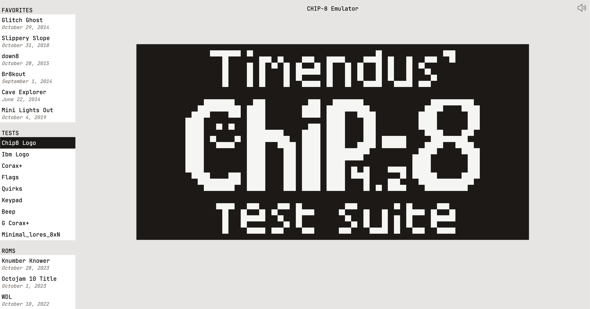

# Chip-8 Emulator in WebAssembly

This is my implementation of a Chip-8 emulator using WebAssembly with some help from TypeScript. For the UI I used React and Tailwind CSS. I've included some roms to test from the [Chip8Archive](https://github.com/JohnEarnest/chip8Archive) repo and some tests from the [Timendus](https://github.com/Timendus/chip8-test-suite) repo.

Demo at [https://chip8.cool.omg.lol](https://chip8.cool.omg.lol)

